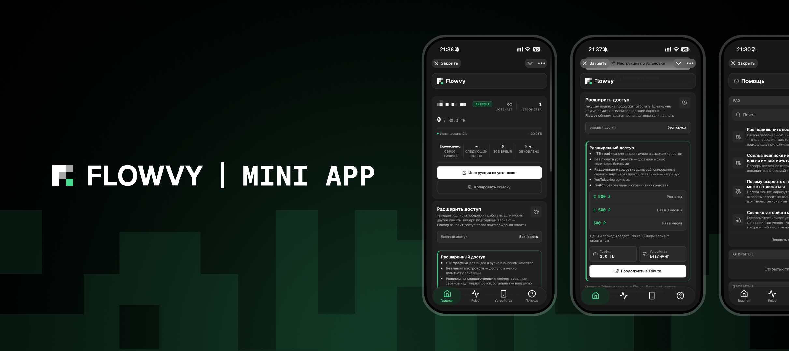

<div align="center">


### Telegram Mini App и бот с открытым исходным кодом для управления Xray-подписками через Remnawave

Telegram · Remnawave · Tribute · Uptime Kuma · Beszel

[](https://github.com/flowvy/mini-app/actions/workflows/ci.yml?query=branch%3Adev)
[](LICENSE)
[](#статус)

[**Возможности**](#почему-mini-app) · [**Установка**](#установка-на-сервер) · [**Документация**](#документация)

<br>



</div>

## Почему Mini-App

- **Подписка внутри Telegram** — трафик, срок действия, ссылка подключения и устройства доступны в
  привычном Mini App без отдельного кабинета
- **Один интерфейс для пользователя и провайдера** — пользователь управляет своим доступом, а
  администратор видит сводку, пользователей, профили доступа и настройки сервиса
- **Безопасная идентификация через Telegram** — сервер проверяет подпись и срок действия `initData`,
  а перед важными действиями повторно проверяет роль и состояние учётной записи
- **Гибкая регистрация** — открытый вход или вход по приглашениям, многоразовые коды, учёт рефералов
  и управляемые профили доступа Remnawave
- **Состояние инфраструктуры** — раздел Pulse показывает данные Uptime Kuma или Beszel, не передавая
  учётные данные в браузер
- **Поддержка и база знаний** — обращения, переписка, быстрые ответы и Telegram-уведомления собраны в
  одном месте
- **Спонсорский доступ через Tribute** — подписки и пожертвования обрабатываются только после
  подписанного события провайдера; возврат со страницы оплаты сам по себе не считается оплатой
- **Настройка под провайдера** — название, логотип и переведённые тексты меняются без отдельной копии
  интерфейса

## Как устроена Mini-App

Mini-App не является прокси-сервером и не заменяет Remnawave. React-приложение обращается только к
FastAPI BFF. Сервер проверяет Telegram-аутентификацию, хранит данные в PostgreSQL и Redis и
взаимодействует с Remnawave, Telegram Bot API, выбранным источником Pulse, Tribute и, при
необходимости, Cloudflare R2.

- `frontend/` — React 19, TypeScript, Vite, TanStack Router/Query и TMA.js SDK
- `backend/` — FastAPI, aiogram, Dishka, SQLAlchemy/Alembic, PostgreSQL и Redis
- `scripts/` — установка зависимостей, локальный запуск и проверка через PowerShell 7
- `docs/` — архитектура, интеграции, безопасность, проверки и эксплуатация

Подробная схема компонентов и границ доверия находится в
[`docs/ARCHITECTURE.md`](docs/ARCHITECTURE.md).

## Статус

> [!WARNING]
> Mini-App остаётся незавершённым MVP. Серверный контейнер и воспроизводимая установка реализованы,
> но реальное развёртывание, восстановление из резервной копии, наблюдаемость и независимая проверка
> безопасности пока не подтверждены. Перед публичным запуском проверьте конфигурацию и предусмотрите
> резервное копирование PostgreSQL.

Проверенные возможности, известные ограничения и ближайшее действие перечислены в
[`docs/PROJECT_STATE.md`](docs/PROJECT_STATE.md).

## Установка на сервер

### 1. Установить Docker

```bash
sudo curl -fsSL https://get.docker.com | sh
```

### 2. Скачать файлы

```bash
sudo -i
mkdir -p /opt/mini-app && cd /opt/mini-app

curl -o docker-compose.yml https://raw.githubusercontent.com/flowvy/mini-app/main/docker-compose.yml && \
curl -o .env https://raw.githubusercontent.com/flowvy/mini-app/main/.env.example
chmod 600 .env
```

### 3. Заполнить `.env`

Сгенерируйте пароль PostgreSQL и секрет Telegram webhook:

```bash
sed -i "s/^POSTGRES_PASSWORD=.*/POSTGRES_PASSWORD=$(openssl rand -hex 24)/" .env && \
sed -i "s/^TELEGRAM_WEBHOOK_SECRET=.*/TELEGRAM_WEBHOOK_SECRET=$(openssl rand -hex 32)/" .env
```

Откройте `.env`:

```bash
nano .env
```

Заполните:

- `APP_DOMAIN`
- `BOT_TOKEN`
- `ADMIN_TELEGRAM_IDS`
- `REMNAWAVE_URL`
- `REMNAWAVE_API_TOKEN`
- `REMNAWAVE_WEBHOOK_SECRET`

### 4. Запустить Mini-App

```bash
cd /opt/mini-app
docker compose up -d && docker compose logs -f -t
```

`Ctrl+C` закроет просмотр журналов, но не остановит контейнеры.

### Обновление

```bash
cd /opt/mini-app && docker compose pull && docker compose down && docker compose up -d && docker compose logs -f
```

## Проверки

```powershell
# проверки изменённых частей
./scripts/verify.ps1 -Scope Changed

# полная проверка: сервисы, миграции, контракты и интерфейс
./scripts/verify.ps1 -Scope Full

# серверный образ и временный Compose-контур без внешних запросов
./scripts/verify-container.ps1
```

Состав и границы автоматических проверок описаны в [`docs/TESTING.md`](docs/TESTING.md).

## Документация

- [`docs/DEPLOYMENT.md`](docs/DEPLOYMENT.md) — установка и обновление на своём сервере
- [`docs/PRODUCT.md`](docs/PRODUCT.md) — роли, пользовательские сценарии и границы продукта
- [`docs/ARCHITECTURE.md`](docs/ARCHITECTURE.md) — компоненты, данные и границы доверия
- [`docs/DEV_ENVIRONMENT.md`](docs/DEV_ENVIRONMENT.md) — установка и локальная разработка
- [`docs/INTEGRATIONS.md`](docs/INTEGRATIONS.md) — Telegram, Remnawave, Pulse, Tribute и R2
- [`docs/SECURITY.md`](docs/SECURITY.md) — требования безопасности и модель угроз
- [`docs/OPERATIONS.md`](docs/OPERATIONS.md) — эксплуатационные процедуры и известные пробелы
- [`docs/PROJECT_STATE.md`](docs/PROJECT_STATE.md) — последнее подтверждённое состояние проекта
- [`CHANGELOG.md`](CHANGELOG.md) и [`CHANGELOG.ru.md`](CHANGELOG.ru.md) — заметки о выпусках

## Разработка

Код Mini-App написан с помощью Claude и OpenAI Codex. Архитектурные решения, проверка результата и
ответственность за публикацию остаются за владельцем проекта.

Локальная разработка проверена на Apple Silicon macOS с Python 3.14.7, uv 0.12.6,
Node.js 24.19.0 LTS, pnpm 11.24.0, Docker Desktop и PowerShell 7. Отдельная инструкция находится в
[`docs/DEV_ENVIRONMENT.md`](docs/DEV_ENVIRONMENT.md).

## Лицензия и бренд

Исходный код Mini-App распространяется по лицензии
[`GNU Affero General Public License v3.0 only`](LICENSE). Если изменённая версия работает по сети для
других пользователей, её соответствующий исходный код также должен быть доступен по условиям AGPL.

Название Flowvy, логотип и фирменные изображения не передаются по AGPL. Изменённые версии должны
использовать собственное название и оформление; подробные правила находятся в
[`TRADEMARKS.md`](TRADEMARKS.md). Лицензии и сведения о сторонних компонентах перечислены в
[`THIRD_PARTY_NOTICES.md`](THIRD_PARTY_NOTICES.md).

---

<div align="center">
<sub>Flowvy Mini App — открытый кабинет для самостоятельного размещения провайдерами Remnawave.</sub>
</div>
